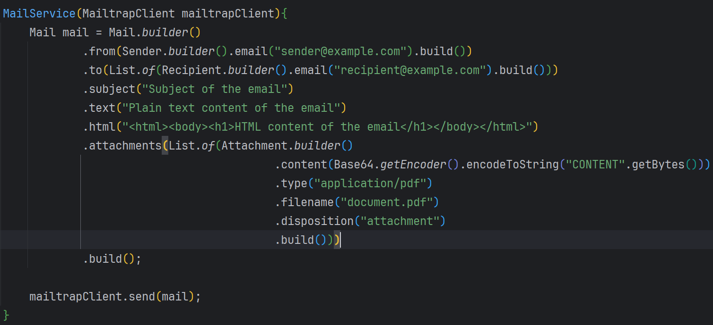

❤ ❤ ❤   MAILTRAP STARTER ❤ ❤ ❤

This is a simple representation of MAILTRAP CLIENT SPRING BOOT STARTER

## Table of contents
* [Description](#description)
* [Technologies used](#technologies-used)
* [Deployment](#deployment)
* [Author](#author)


## Description

API documented >Send email (text, html, text&html, templates)

### Prerequisites

## Technologies used

* Java 21
* Spring Boot 3.2.5
* Maven 3.X.X

## Deployment

Add this project to your IDE as Maven project.
Add Java SDK 21 in project structure.
Create an executable jar file:
```
$> mvn clean install
```
Go to /target and check that file exists:
```
$> spring-boot-starter-mailtrap-client-0.0.1-SNAPSHOT.jar
```
It means that my starter already in your local maven repository.

Go to pom.xml of your project and add dependency
```
<dependency>
    <groupId>ruslan.simakov</groupId>
    <artifactId>spring-boot-starter-mailtrap-client</artifactId>
    <version>0.0.1-SNAPSHOT</version>
</dependency>
```
Add to application.properties your MAILTRAP API token.
```
mailtrap-client.api-token=your-api-token
```
Example of usage:

Enjoy to test everything)

## Author
SIMAKOV RUSLAN
https://www.linkedin.com/in/simakoff/
